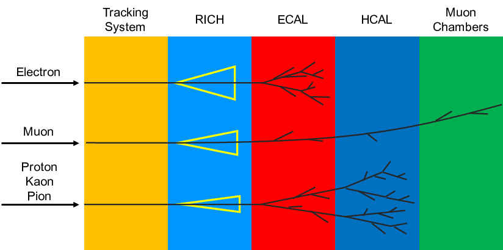

# Классификация частиц в LHCb с помощью нейросетей

Этот проект посвящён задаче многоклассовой классификации частиц, зарегистрированных в экспериментах на Большом адронном коллайдере (LHCb). Модель построена с использованием фреймворка [TensorFlow](https://www.tensorflow.org) и экспортирована в формат [ONNX](https://onnx.ai) для переносимости.

## Описание задачи

По наборам признаков событий модель должна определить тип частицы (электрон, мюон, пион, каон, протон или "призрак" — ошибочное срабатывание детектора).

Пример визуализации:



Физические подробности эксперимента можно найти в [оригинальной статье](https://iopscience.iop.org/article/10.1088/1748-0221/3/08/S08005/pdf).

## Данные

- Тренировочный набор:  
  [training.csv.gz](https://github.com/hse-aml/hadron-collider-machine-learning/releases/download/Week_2/training.csv.gz)

- Тестовый набор (без меток):  
  [test.csv.gz](https://github.com/hse-aml/hadron-collider-machine-learning/releases/download/Week_2/test.csv.gz)

Файл `training.csv.gz` необходимо сохранить локально. Загружать его в репозиторий не нужно — он слишком большой.

## Структура проекта

- `particles.py` — скрипт для обучения модели и сохранения её в формате ONNX (`particles.onnx`)
- `predict.py` — пример использования обученной модели на тестовых данных
- `particles.onnx` — финальная обученная модель
- `particles.json` — метрики качества модели:
  ```json
  {
    "test_auc": {
        "Electron": 0.98,
        "Ghost": 0.90,
        "Kaon": 0.91,
        "Muon": 0.99,
        "Pion": 0.94,
        "Proton": 0.90
    }
  }
